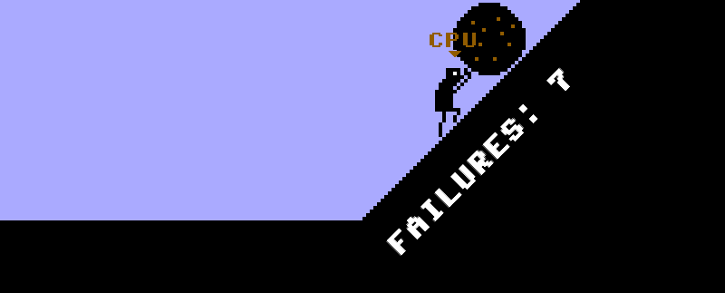

# *Let's Play: Ancient Greek Punishment: CPU Edition*

# [Play Online](http://www.pippinbarr.com/letsplayancientgreekpunishmentcpuedition/) (desktop and mobile)

## Description
*Watch the computer struggle against the chains it put itself in! Watch the computer try to drink the water it moves out of reach! Watch the computer push a rock up a hill and knock it down again! In a joyful infinite loop! One must imagine CPU Sisyphus happy!*

*CPU Edition* is a version of my "classic" game [*Let's Play: Ancient Greek Punishment*](https://www.pippinbarr.com/lets-play-ancient-greek-punishment/info) altered to be played entirely by a CPU player instead of a human. So, you just kind of watch. It was good enough for Venice!

## Documentation
* Read the [Process Documentation](../process) for todos, process journal, blog posts, and correspondence
* Read the [Commit History](https://github.com/pippinbarr/letsplayancientgreekpunishmentcpuedition/commits/master) for detailed, moment-to-moment insights into the development process
* Look at the [Code Repository](https://github.com/pippinbarr/letsplayancientgreekpunishmentcpuedition) for source code etc.

## Press
Read the [Press Kit](../press) for press information

## License
_Let's Play: Ancient Greek Punishment: CPU Edition_ is licensed under a [Creative Commons Attribution-NonCommercial 3.0 Unported License](http://creativecommons.org/licenses/by-nc/3.0/).

---

Made in the [Technoculture, Art, and Games (TAG) Lab](http://tag.hexagram.ca/).  
Made in the [Milieux Institute for Arts, Culture, and Technology](http://milieux.concordia.ca/).
