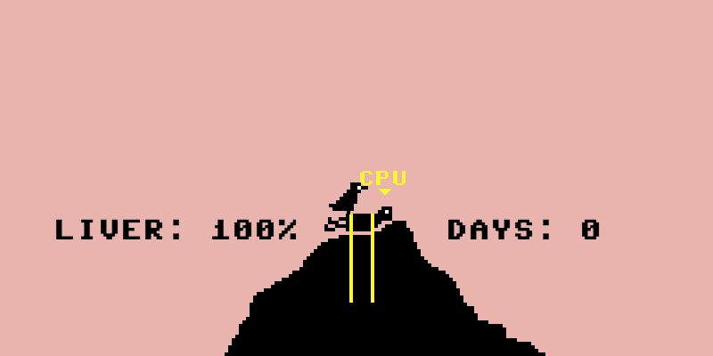

# *Let's Play: Ancient Greek Punishment: CPU Edition!* Press Kit

#### [Play *Let's Play: Ancient Greek Punishment: CPU Edition!*](https://pippinbarr.github.io/letsplayancientgreekpunishmentcpuedition/)

## The basics

* Developer: [Pippin Barr](http://www.pippinbarr.com/)
* Release: Xth of X, 2017
* Platform: Browser (mobile- and tablet-friendly)
* Code repository: https://www.github.com/pippinbarr/letsplayancientgreekpunishmentcpuedition/
* Price: $0.00

## Description

!!!

## History

*Let's Play: Ancient Greek Punishment: CPU Edition!* ...

## Technology

*Let's Play: Ancient Greek Punishment: CPU Edition!* is written in JavaScript using [Phaser](http://www.phaser.io/), an excellent JavaScript game library/engine. The sounds and graphics for *Let's Play: Ancient Greek Punishment: CPU Edition!* were all taken from the assets of my earlier game [*Let's Play: Ancient Greek Punishment!*](https://www.pippinbarr.com/2011/12/30/lets-play-ancient-greek-punishment/) (except for the CPU indicators, which are new).

*Let's Play: Ancient Greek Punishment: CPU Edition!* is an open source game licensed under a [Creative Commons Attribution-NonCommercial 3.0 Unported License](http://creativecommons.org/licenses/by-nc/3.0/). You are looking at the code (and process and press) repository right now.

## Features

*

## Videos

### [Let's Play: Ancient Greek Punishment: CPU Edition! Trailer](https://www.youtube.com/watch?v=...)

## Images

    

## Press

* Coming soon?

## Additional Links

* [Developer blog posts about *Let's Play: Ancient Greek Punishment: CPU Edition!*](http://www.pippinbarr.com/tag/lets-play-ancient-greek-punishment-cpu-edition?order=asc)

## Credits

* Pippin Barr: everything.

## Contact

* Email: [pippin.barr+press@gmail.com](mailto:pippin.barr+press@gmail.com)
* Website: [www.pippinbarr.com](http://www.pippinbarr.com/)
* Twitter: [@pippinbarr](https://www.twitter.com/pippinbarr)
* Facebook: [Pippin Barr](http://www.facebook.com/pippin.barr)
