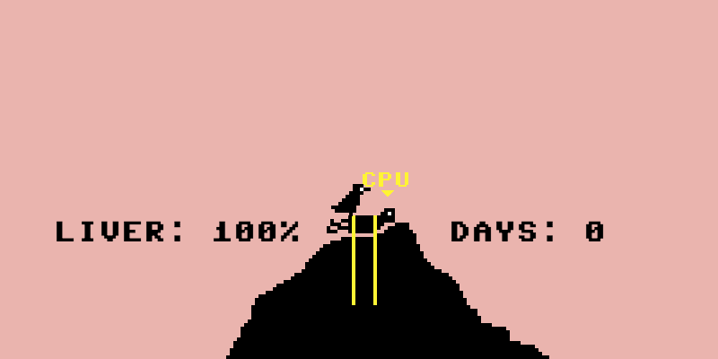
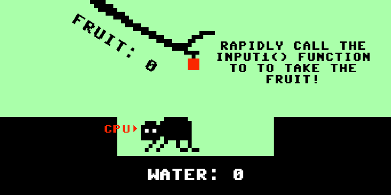
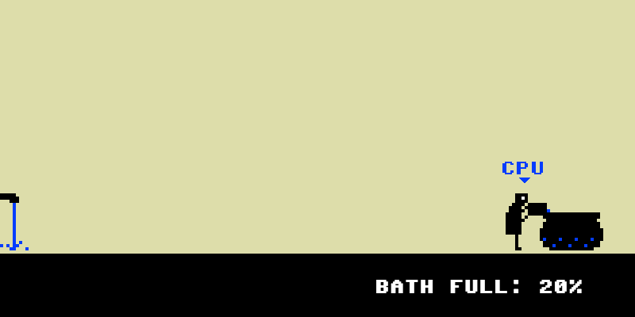
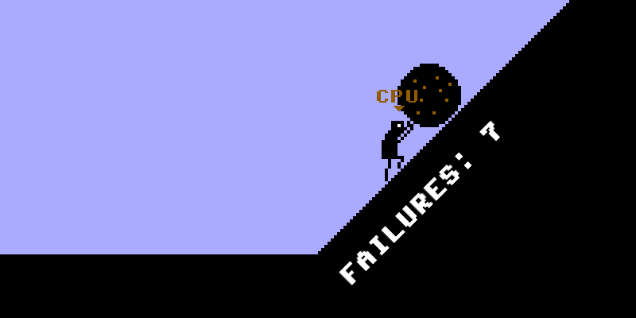
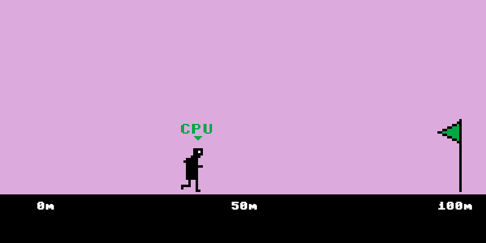

# *Let's Play: Ancient Greek Punishment: CPU Edition!* Press Kit

#### [Play *Let's Play: Ancient Greek Punishment: CPU Edition!*](https://pippinbarr.github.io/letsplayancientgreekpunishmentcpuedition/)

## The basics

* Developer: [Pippin Barr](http://www.pippinbarr.com/)
* Release: Xth of X, 2017
* Platform: Browser (mobile- and tablet-friendly)
* Code repository: https://www.github.com/pippinbarr/letsplayancientgreekpunishmentcpuedition/
* Price: $0.00

## Description

Watch the computer struggle against the chains it put itself in! Watch the computer try to drink the water it moves out of reach! Watch the computer push a rock up a hill and knock it down again! In a joyful infinite loop! One must imagine CPU Sisyphus happy!

## History

*Let's Play: Ancient Greek Punishment: CPU Edition!* came about as a natural extension of my continuing series of games based on, well, ancient Greek punishments. I'd already made a reconfiguration of the game in which the human player can 'win' against the various punishments, and I've spent a fairly substantial amount of time thinking about the idea of computers the context of videogames as these simultaneously indefatigable and fragile agents, so it made sense to remake the game with that even more to the foreground. The clear answer to this was to make a version of the game that is not only represented/simulated by the computer, but is also *played* by the computer as well. There's plenty of meditation on both the metaphysics and specifics of this available in the [blogposts I've written about the game](http://www.pippinbarr.com/tag/lets-play-ancient-greek-punishment-cpu-edition?order=asc).

## Technology

*Let's Play: Ancient Greek Punishment: CPU Edition!* is written in JavaScript using [Phaser](http://www.phaser.io/), an excellent JavaScript game library/engine. The sounds and graphics for *Let's Play: Ancient Greek Punishment: CPU Edition!* were all taken from the assets of my earlier game [*Let's Play: Ancient Greek Punishment!*](https://www.pippinbarr.com/2011/12/30/lets-play-ancient-greek-punishment/) (except for the CPU indicators, which are new).

*Let's Play: Ancient Greek Punishment: CPU Edition!* is an open source game licensed under a [Creative Commons Attribution-NonCommercial 3.0 Unported License](http://creativecommons.org/licenses/by-nc/3.0/). You are looking at the code (and process and press) repository right now.

## Features

* Chains and an eagle!
* A boulder and a hill!
* Water and an apple!
* A bath and a bucket!
* A nearby flag!
* Artificial "Intelligence"

## Videos

### [Let's Play: Ancient Greek Punishment: CPU Edition! Trailer](https://www.youtube.com/watch?v=HI55xCFFvDs)

## Images

    

## Press

* Coming soon?

## Additional Links

* [Developer blog posts about *Let's Play: Ancient Greek Punishment: CPU Edition!*](http://www.pippinbarr.com/tag/lets-play-ancient-greek-punishment-cpu-edition?order=asc)

## Credits

* Pippin Barr: everything.

## Contact

* Email: [pippin.barr+press@gmail.com](mailto:pippin.barr+press@gmail.com)
* Website: [www.pippinbarr.com](http://www.pippinbarr.com/)
* Twitter: [@pippinbarr](https://www.twitter.com/pippinbarr)
* Facebook: [Pippin Barr](http://www.facebook.com/pippin.barr)
