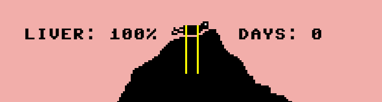
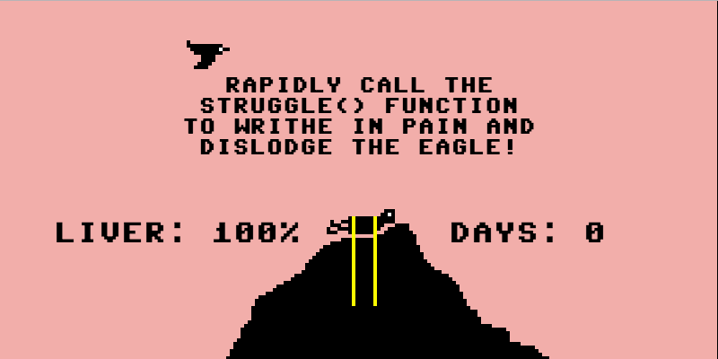
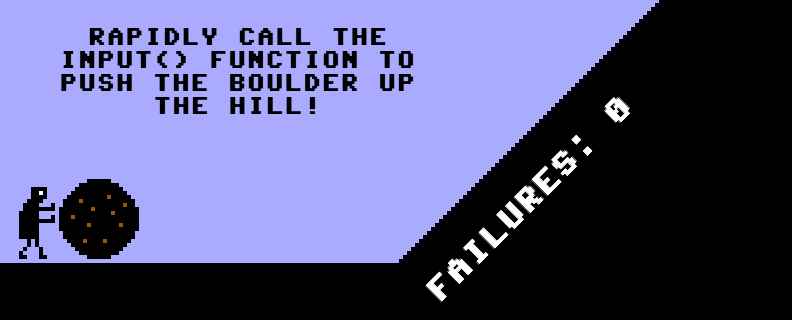
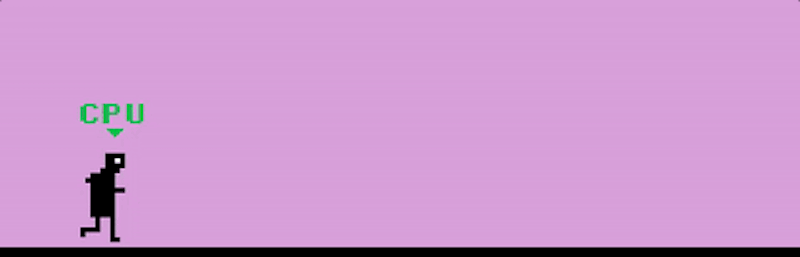
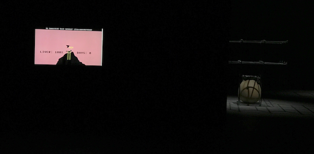

# Blog Posts

Here are public-facing blog posts I wrote about the game.

## New Project: Let's Play: Ancient Greek Punishment: CPU Edition (2017-03-17)

So _v r 3_ isn&#8217;t strictly speaking finished, but it&#8217;s at least out with a couple of people for testing (yes, it&#8217;s with my parents) for now. Restless guy that I am, I started working on a new thing yesterday because otherwise my self-worth would pour out of my eyes as bitter tears. The new thing is yet another iteration on my exciting franchise _Let&#8217;s Play: Ancient Greek Punishment_. I actually kind of like the vague intimation with all these follow-up versions that I&#8217;m somehow &#8220;chasing the magic&#8221; of the first game, which was really &#8220;successful&#8221; in terms of traffic and attention. I don&#8217;t think I am, but maybe I am.

The new version uses the format to explore a particular extreme, which is the idea of a game you don&#8217;t even get to play &#8211; instead the computer plays the game itself. It&#8217;s related to _Best Chess_ in a way, with the player in the role of observer (and admirer?) rather than active participant, but it cuts out the player entirely &#8211; you don&#8217;t even make a move. It also summons to my mind Jesper Juul&#8217;s writing on [Zero-Player Games](https://www.jesperjuul.net/text/zeroplayergames/), though I haven&#8217;t read that recently enough to be able to comment on resonances between this game and Juul&#8217;s thoughts (I&#8217;m sure they&#8217;ll be there, and I&#8217;ll re-read the paper sometime soon I swear). So the setup is, to be clear, we have a game that is more or less identical to the original (in terms of the code and its possibilities), but instead of player input triggering things in the game (like Prometheus&#8217; writhing), the computer triggers those aspects itself as well.

That raises a few different things to think about, and I will try to write something about those things next week. I can&#8217;t be bothered right now, but rest assured it&#8217;s going to be _super_ interesting when I get to it. This is just a project announcement. Consider yourselves warned.

## `struggle();` (2017-03-20)

I finished making the Prometheus level/version/minigame of _Let&#8217;s Play: Ancient Greek Punishment: CPU Edition_ the other day, which means I&#8217;ve now had a chance to go through various of the required conceptual grapplings involved in this particular edition of the series. As per usual, my assumptions going in have been kind of rejected/realigned thanks to the realities of actually sitting down and building the game itself &#8211; perhaps the most important argument for making games a reality even if they just seem like a &#8216;funny idea&#8217; or whatever. You may not entirely know what you&#8217;re doing. I rarely do.

Going into this game my idea was that the code would be more or less _identical_ to the original game, except that I would disable user input and instead would have computer code (running on some kind of timer) triggering the required inputs &#8211; generally speaking this would mean the computer alternately triggering keypress events for &#8216;g&#8217; and &#8216;h&#8217; over and over again. It turned out, however (for me at least), that simulating keypresses (or mouse clicks) didn&#8217;t actually work out (fast enough) for me. I struggled with it for while, doing the usual trawling of the internet, but never found a satisfactory approach.

But the very fact it wasn&#8217;t working kind of fits into the narrative of the game, I guess. If I can&#8217;t get the computer to do things that way, then that&#8217;s simply _not how the computer would play the game_. It&#8217;s kind of a truism. Rejecting the kind of human-centric idea of the computer having to trigger keyboard input meant I could rethink how a computer might interact with the game, at which point it seemed suddenly very clear that the computer would simply _call a function_ to cause Prometheus to struggle. Why would it bother to go a circuitous route? Above I called the method _struggle()_ but now I&#8217;m calling it _INPUT()_ for sheer computeriness.

Thus the game work by loading the game as per usual, but instead of allowing for human input, there&#8217;s just a function you need to call again and again to struggle (or push a boulder or run a race etc.) and that&#8217;s what the computer player does, in the form of JavaScript&#8217;s _setInterval()_ function, which runs the same code repeatedly with some interval in between. That&#8217;s the &#8216;AI&#8217; of the CPU player in this game. I did think for a while about the idea of the CPU player being a kind of separate script from the game proper, so it was like the CPU was playing the game &#8216;from the outside&#8217;, but I don&#8217;t think that&#8217;s necessary for the game to make sense.

Perhaps most importantly, when I run the game and watch the little Prometheus struggling bravely (forever), it seems to feel like something. It&#8217;s weird to look at, knowing the the code is both generating the situation and the response to the situation at the same time, kind of eery and wrong. Which is great, obviously.

So: so far so good and thanks for asking.

## Unreal Code (2017-03-22)

Have been beetling my way through the different parts of _Let&#8217;s Play: Ancient Greek Punishment: CPU Edition_ over the last days, now through with Prometheus, Zeno, the Danaids, and Sisyphus. Just Tantalus and the menu system to go, really, before it&#8217;s basically a finished product (though I need to think a bit about having a CPU indicator in the game, as I think that would look nice – though it&#8217;s proving annoying to think of how to do it).

Today&#8217;s entertainment was while working on Sisyphus. That level has a really specific &#8216;fail state&#8217; animation where, if you&#8217;re not pressing the buttons fast enough while Sisyphus is pushing the boulder uphill he starts getting pushed backwards back to the bottom. I was working away on the code for this and then tried to test it only to realise that this can _never happen_ to the CPU playing the game &#8211; it&#8217;s always going to be &#8216;pressing the buttons&#8217; fast enough, it will never be pushed back down the hill (except by the automatic fail state at the top of the hill). So I actually had to deactivate the computer player and implement controls for a human player specifically so I could test what happens when there is a fail state.

As it happens, this revealed that the fail states weren&#8217;t working at all &#8211; Sisyphus would jump all over the screen in whacky ways. Again, this behaviour is invisible when the computer plays because the fail states aren&#8217;t triggered. So I had to debug all the failure stuff by testing with my pathetic human ability to fail, fixing the code up so it reflects the original game faithfully and well. So in the end I spent most of my time working on the Sisyphus level actively engaged in writing and fixing code that will literally never be processed by the game once its&#8217; complete. But, of course, it has to be there for reasons of authenticity &#8211; if the failure code weren&#8217;t there, there would be no counterpoint to the computer&#8217;s repeated &#8216;success&#8217; (success at failure, in a way?), and it feels like that encoded possibility of failure is needed for the success to register properly.

On the other hand, to the extent that the code _cannot_ be triggered, it&#8217;s not entirely clear that it&#8217;s really there? Like, a really smart compiler would be able to determine that the code cannot be executed, for instance, and just not include it at all. But _that_ said, JavaScript is an &#8216;interpreted&#8217; language, which means it doesn&#8217;t get compiled and this kind of vestigial code is still &#8216;legitimate&#8217; I suppose. I suppose? So it&#8217;s there and not there. Schrödinger&#8217;s code.

Unreal code,

Under the brown fog of a winter dawn,

## Indicators of Effort (2017-03-24)

_Let&#8217;s Play: Ancient Greek Punishment: CPU Edition!_ is pretty much all done now, a welcome &#8216;easy&#8217; game to make in the wake of _v r 3_ that was so technically challenging (for me, personally). The final addition I made was to go through and add in indicators that point to the CPU player as it goes through the various motions/trials of the different levels of the game (as above) for Zeno. I vacillated on including the indicators for a while chiefly because I had to manually add them frame by frame for a couple of the levels (Sisyphus and Tantalus), but in the end it seemed too important to the nature of the game to omit.

Specifically, although the game communicates that it is the computer playing the game both through its title (&#8220;CPU Edition!&#8221;) and the brute fact that the player has no input, it didn&#8217;t feel like it was necessarily bringing home the potential pathos of watching the computer struggle in the different scenarios. Notably, the game and an animated GIF of the game are kind of interchangeable and it might be possible for a player (if that&#8217;s the right word) to think they were merely watching an animation or a video of a game, rather than the game itself. Adding the &#8216;CPU&#8217; indicator, although it could of course _also_ be represented in a video, helps to constantly explain the automated nature of the game as it proceeds, and also helpfully assigns the computer to player to the specific _character_ on the screen, rather than to the game as a whole.

Thus, the computer is both tormentor and tormented, eagle and Prometheus, perforated bathtub and Danaid, Sisyphus pushing the boulder up the hill and the unseen force sending it flying back down again. This division of labour makes much more sense with the individuating &#8216;CPU&#8217; indicator to separate the character controlled by the computer from the game world simulated by the same computer, I think. Maybe I&#8217;m over-thinking this, but it genuinely seems important when I think about it.

Still, it remains true that in the end the game could _still_ be represented as an animated GIF and appear _literally exactly the same_ when you watch it in a browser window. But in a way, aren&#8217;t all looping animated GIFs a kind of Sisyphean torture for the computer? Rendering frame after frame to the screen with no end in sight, at the mercy of the vagaries of the human user to set it free from its infinite task? Or perhaps, au contraire, we might think of infinite loops in computation as the ultimate pleasure for a CPU – the constant and unending expression of their singular abilities to process information indefinitely and without fatigue?

Might one in fact imagine CPU Sisyphus happy?

## Pippin does Venice (2017-09-04)

The above image, taken by my parents, is of my game [Let's Play: Ancient Greek Punishment: CPU Edition!](http://www.pippinbarr.com/2017/04/12/lets-play-ancient-greek-punishment-cpu-edition/) in situ at the 2017 Venice Biennale. In Venice. For real. It's part of an installation/show called [#HYPERPAVILLION](http://hyperpavilion2017.com/), with my own contribution forming part of a screen curated by [NT2](http://nt2.uqam.ca/en), a research lab based out of UQÀM here in Montréal. On the screen you can select to view a set of different pieces work, including my colleague and friend [Skawennati](http://www.skawennati.com/)'s [Time Traveller™](http://www.timetravellertm.com/).

There are three main things this makes me think about this evening,

First of all, it's a testament to the wonderful randomness of life that I'm even part of the show at all. I met the NT2 crowd via giving a talk about my work at the lab and having a discussion with them, and that connection was kind of activated by them being invited to have a screen in the #HYPERPAVILLION space and me having a piece of work that made sense with their key line of inquiry, which was "What if?" (in my case, the "what if" of a game that plays itself). It's kind of amazing how possibilities interlock into opportunities sometimes - much luck on my end, anyway.

Second, the nature of the installation relates in an interesting way to the specific game. The works curator by NT2 all share a single screen with an interface for switching between the different artists' contributions. While each of the other artworks is a _video_ piece, _Let's Play: Ancient Greek Punishment: CPU Edition!_ is obviously a game. Well, maybe not "obviously" since we can probably quibble over the definition, but it's premised on code running very centrally - the entire point is that the computer is actually _running_ the game, that it _isn't_ a video, even while it looks like one (and is indistinguishable from one for an onlooker). As such, NT2 technical support team were terrific in that they were very prepared to go the extra mile(s) required to make it such that, while the other works presented were videos, the game was presented on screen in its "pure form", running as JavaScript. That tension between looking like a video and "being" like software is part of the work, so it's really nice to have that play out in the actual process of exhibiting it, too.

Finally, the fact of my parents going to see the work (they were going to Venice and the Biennale anyway, don't worry) really managed to lock in the sense of the exhibition being a real thing. They were sending me chat messages over the morning reporting on how the work looked in the space and showing me pictures of it (hard to photograph because of light levels, as you can see from the picture). My games are exhibited with some frequency (I have no idea if it's a lot or a little, but frankly I'm thoroughly impressed that it's "at all"), but it's kind of hard to gain any emotional traction on the physical fact. My interaction with exhibitions tends to me emailing relevant files and rewriting bits of code to be "gallery ready" as required - as such, it turns more into an excercise in logistics, followed by a resounding _non_-awareness of the physical reality of the show itself. It's only today that I'm registering a kind of sadness at not being able to feel more connected to the work as it heads out there.

(Though, finally finally, I'd also add that all the times I've been in the same room as my work being exhibited - which isn't many - I felt a deep and unpleasant sense of discomfort with the experience. So maybe it's all for the best to be blissfully unaware? Or maybe the moral of the story is that I should send my parents as emissaries to all the shows to text message me about them... just the right about of connection and alienation...)
